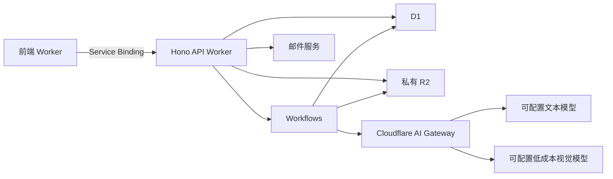

# 「补位」AI 项目办公室：前后端统一开发计划

**2026-09-30 接入记录：用户本次明确授权前后端功能对齐、真实 API 接入、游客演示隔离、接入过程中的缺陷修复与 GitHub 依赖告警处理。具体完成项、验证和剩余上线条件见 [实现对齐报告](docs/IMPLEMENTATION-ALIGNMENT.md)。以下计划中的验收条件仍作为目标，历史“默认只执行前端”约定不限制本次已授权工作。**

**执行范围约定：除非用户特别注明，AI 默认只执行本计划中的“前端开发计划”，包括当前对话。后端计划用于接口协商和开发交接，不代表授权当前 AI 实施后端。**

前端任务包含页面、交互、PWA、模拟服务、前端接口适配、测试及前端部署配置。后端任务包含真实鉴权、数据库、文件服务、模型调用、异步任务及后端部署。接口契约由双方共同确认，不能单方面修改。

项目采用前后端分离，首版为桌面优先的中文 PWA，后续追加 Tauri 客户端。忽略现有项目内容及 `plan.md`，实施时使用独立目录，避免覆盖已有文件。

共同目标是完成：

**导入通知 → 确认要求 → 团队分工 → AI 补位 → 材料采纳与留痕 → 预审与答辩 → 导出成果说明。**

比赛约束：2026 年 10 月 8 日前完成报名及材料最终提交；本赛道参赛者最多 5 人，指导教师不计入。必交材料包括申报书及承诺书扫描 PDF、作品介绍 PDF、最多 10 分钟且不超过 500 MB 的 MP4 视频。具体截止时刻未注明，不虚构。前端先行，真实后端联调日期另定；模拟演示不能替代比赛要求的真实可体验产品。

## 一、前端开发计划——当前对话默认执行范围

### 1. 技术架构与职责

| 项目 | 选择 |
|---|---|
| 工程 | React＋TypeScript＋Vite，开启严格类型检查 |
| 路由 | React Router |
| 服务端数据状态 | TanStack Query |
| 材料编辑 | Tiptap，限定标题、段落、列表、表格、链接等基础节点 |
| PDF 预览与页面渲染 | PDF.js |
| 模拟服务 | MSW，遵循统一 OpenAPI 契约 |
| 验证 | Vitest＋Playwright |
| 部署 | Cloudflare Workers Static Assets |
| 平台形态 | 可安装 PWA；通过平台适配层为后续 Tauri 预留扩展点 |

前端 Worker 负责静态资源与 `/api/*` 转发，通过 Service Binding 连接后端。所有权限最终由后端判断。

不在前端保存模型密钥、直接访问数据库或调用模型供应商。

### 2. 页面和功能清单

| 功能区域 | 必须实现的内容 |
|---|---|
| 登录与项目入口 | 邮箱验证码登录、登录状态恢复、项目列表、创建项目、接受邀请 |
| 项目概览 | 截止日期、任务进度、材料缺项、待确认事项、最近活动 |
| 通知导入 | 图片、PDF、TXT／Markdown、粘贴文字、公开网页链接 |
| 要求确认 | 原文与提取结果对照、依据跳转、字段修改、负责人确认 |
| 团队分工 | 成员技能和投入时间、角色缺口、AI 分工建议及人工应用 |
| 任务工作台 | 列表／看板、负责人、截止日期、状态、关联要求与材料、评论 |
| AI 工作区 | 代做、带做、只审；输入资料选择、任务状态、输出复核与采纳 |
| 材料中心 | 富文本编辑、版本历史、附件、评论、Markdown 导出、打印 PDF |
| 预审 | 材料版本选择、分项问题、依据、模拟分数、修改建议 |
| 答辩演练 | 全项目或按成员负责部分练习、逐题回答、追问、总结 |
| 过程账本 | 决策、贡献、AI 使用记录、补录与更正、第三方来源 |
| 项目设置 | 成员邀请与移除、项目基本信息、来源和评分版本查看 |

### 3. 核心交互规则

**通知解析与确认**

- 区分“原文要求”“AI 建议”“人工确认”。
- 信息缺失时显示待确认，不补造评分权重或截止时刻。
- PDF 引用跳到对应页；网页或文字引用定位原文片段。
- 重新解析显示新旧结果差异，不覆盖已有确认内容。
- 本次比赛模板保存五人限制及评分规则，但不将其硬编码为所有项目的限制。
- 链接无法读取时保留链接，并引导改用文件或文字。

**三档 AI 补位**

- 代做：生成可编辑草稿。
- 带做：按步骤提问，结合回答逐步形成成果。
- 只审：检查已有材料并给出问题、依据和建议。
- 所有生成内容先进入草稿；采纳必须明确确认“已人工复核”。
- 采纳创建新材料版本，保留 AI 原始结果及人工修改关系。
- AI 不会直接将任务标为已完成或覆盖正式成果。

**预审与答辩**

- 本赛事按 20／25／20／25／10 的权重显示非官方模拟评分。
- 自拟细则明确标注；标准不完整时仅提供定性意见。
- 预审关联特定材料版本；材料更新后提示报告针对旧版本。
- 答辩采用文字逐题交互，不加入语音功能。
- 对成员的练习反馈不转化为个人贡献排名。

**异步协作**

- 保存材料提交 `expectedRevision`。
- 收到 `409 VERSION_CONFLICT` 时保留本地内容，展示服务器新版本，允许比较后重新保存。
- 对离线、保存中、已保存、保存失败给出明确状态。
- 负责人管理成员并确认要求；全员可编辑任务材料和采纳 AI 草稿。

### 4. PDF、图片与低成本识别配合

后端优先提取 PDF 文本层；仅对扫描页、疑似缺失页或用户指定页进行视觉模型识别。

前端负责：

1. 上传原 PDF，展示提取进度。
2. 获取后端返回的待渲染页码。
3. 用 PDF.js 渲染对应页面。
4. 上传关联 `sourceVersionId + pageNumber` 的页面图片。
5. 展示逐页识别结果和失败页，支持继续上传或人工补充。

默认页面图片长边 2000 像素、单张最多 2 MiB；无法识别时允许生成更清晰版本。原文件最多 10 MiB、PDF 最多 30 页，具体限制从 `/capabilities` 获取。

关闭页面后可恢复未完成流程。页面图片作为客户端衍生输入，不宣称能独立证明原 PDF 未被修改。

### 5. 材料与导出

- 材料以约定的 Tiptap JSON 节点集合编辑；版本和规范 Markdown 由后端保存。
- 导出 Markdown；打印页隐藏导航和操作按钮，处理分页、表格、页边距和中文字体。
- 作品介绍模板包含名称、3–5 个关键词、概要、教育痛点、创新点、落地场景、应用成效。
- 贡献说明、AI 使用声明及第三方资源清单可单独打印。
- 无真实试用数据时保留待填写，不生成虚构成效。
- 官方申报书仍从比赛平台生成、签字和提交。
- 视频仅做本地格式、体积及可读取时的时长预检，不上传到本产品或转码。

### 6. PWA、响应式与 Tauri 预留

- 桌面支持完整流程；移动端优先保证任务、评论、答题和基础编辑可用。
- PWA 支持安装、应用外壳缓存、离线提示和更新提示。
- 不默认缓存完整项目和附件。
- 本地草稿按账户、项目和材料隔离；恢复联网后由用户确认保存。
- 退出前提示未同步内容，退出后清除该账户本地业务数据。
- 将文件选择、下载、打印、本地草稿等能力封装为平台适配层。
- 本阶段不创建 Tauri 工程或设计桌面自动更新系统。

### 7. 模拟服务与前后端契约

前端先依据 OpenAPI 实现完整流程，可切换模拟和真实 API。

- 模拟环境持续显示“演示数据／模拟 AI”。
- 真实模式失败时，不得自动切换模拟数据并显示成功。
- 模拟服务覆盖正常、空数据、延迟、失败、权限不足、版本冲突和额度不足。
- 生成结果、预审和答辩都采用真实任务状态协议。
- `/capabilities` 返回文件限制、可用功能和是否启用 AI，不暴露密钥。

统一响应：

```ts
type ApiSuccess<T> = {
  data: T;
  requestId: string;
};

type ApiFailure = {
  error: {
    code: string;
    message: string;
    retryable: boolean;
    details?: Record<string, unknown>;
  };
  requestId: string;
};
```

异步任务返回 `202 + jobId`。前端从 2 秒轮询开始，逐渐退避至 10 秒；页面不可见时暂停，恢复时重新查询。

### 8. 实施顺序与前端验收

| 阶段 | 内容 | 验收 |
|---|---|---|
| F0 | 工程、路由、视觉规范、公共类型、OpenAPI 初稿 | 可启动、可构建，双方确认核心接口 |
| F1 | 登录、项目、通知导入与确认、概览 | 模拟数据完成创建项目与确认要求 |
| F2 | 团队、任务、材料、三档 AI、采纳 | 从任务到成果的完整交互可用 |
| F3 | 预审、答辩、账本、导出 | 四模块闭环，引用和版本可追溯 |
| F4 | PWA、移动端、错误恢复、无障碍 | 安装、离线草稿、冲突与键盘操作验证通过 |
| F5 | 真实 API 联调、Cloudflare 预览部署 | 两个真实账户完成端到端流程 |

必须验证：

- 本赛事要求及五项评分展示准确。
- 重复点击、过期邀请、验证码失败、解析失败、AI 失败和版本冲突可处理。
- 打印无截断、重叠，表格和中文内容可读。
- 桌面及手机布局、PWA、离线与重连恢复。
- 类型检查、lint、构建、关键组件测试和 Playwright 主流程通过。

前端交付物：源码、可构建演示、模拟服务、公共契约、部署配置、验证报告、后端接口交接说明。后端未就绪时明确标记“前端验证完成，真实联调待完成”。

## 二、后端开发计划——交由后端同学执行

### 1. 部署架构与技术栈



| 部分 | 首版选择 |
|---|---|
| 语言及路由 | TypeScript＋Hono |
| 校验及契约 | Zod＋OpenAPI 3.1 |
| 数据访问 | D1 prepared statements＋SQL migrations，不引入 ORM |
| 文件 | 私有 R2 |
| 耗时处理 | Cloudflare Workflows |
| PDF 文本层 | `unpdf`，按页提取 |
| 模型 | Cloudflare AI Gateway 统一调用 |
| 邮件 | `EmailProvider` 适配器，首个实现为 Resend HTTP API |
| 测试 | Vitest＋Cloudflare Workers 测试环境 |

采用模块化单体后端。首版不引入向量数据库、Redis、实时协同、独立微服务或自主多 Agent 协商。

### 2. 业务模块和数据库

| 模块 | 核心表 | 主要职责 |
|---|---|---|
| 身份 | `users`、`auth_challenges`、`sessions` | 验证码、用户和会话 |
| 项目 | `projects`、`project_members`、`invitations` | 项目、成员权限、邀请 |
| 来源 | `files`、`sources`、`source_versions`、`source_pages`、`source_fragments` | 文件、文本、页面和引用 |
| 要求 | `requirement_sets`、`requirements`、`rubric_versions` | 要求确认和评分标准版本 |
| 任务 | `tasks`、`task_links`、`comments` | 分工、任务状态和讨论 |
| 材料 | `materials`、`material_versions` | 当前材料和不可变版本 |
| AI | `agent_sessions`、`agent_turns` | 三档补位和多轮状态 |
| 预审答辩 | `reviews`、`rehearsals`、`rehearsal_turns` | 输入快照、问题、回答和反馈 |
| 证据 | `events`、`decisions`、`contributions`、`resource_references` | 决策、贡献和来源声明 |
| 基础设施 | `jobs`、`job_outbox`、`idempotency_records`、`ai_config_versions`、`ai_calls`、`usage_reservations` | 任务恢复、幂等、配置和预算 |

共同数据规则：

- 项目业务表包含 `project_id`，访问资源时检查项目归属。
- 时间戳存 UTC；日期型通知字段保留日期精度与时区，不自动补时刻。
- 可修改实体包含 `revision`；历史快照不可覆盖。
- 材料版本唯一键为 `(material_id, revision)`。
- 成员唯一键为 `(project_id, user_id)`。
- 会话轮次唯一键为 `(session_id, sequence)`。
- 账本通过项目、操作、事件类型、实体唯一约束去重。
- JSON 保存富文本和快照，项目、用户、状态等常用查询字段独立成列。
- 列表使用游标分页，默认 20 条、最多 100 条。

统一引用：

```ts
type Citation = {
  sourceVersionId: string;
  fragmentId: string;
  pageNumber: number | null;
  quote: string;
};
```

服务端验证引用属于本项目及本次输入，且引文确实存在。OCR 内容保留识别方法和待确认状态。

### 3. 登录、邀请与权限

验证码：

- 6 位随机数字，10 分钟有效，最多尝试 5 次。
- 单邮箱发送间隔至少 60 秒，叠加邮箱和 IP 限制。
- 使用服务端密钥计算 HMAC，绑定邮箱与挑战 ID；不存明文验证码。
- 通过条件更新一次性消费，防止并发重复验证。

会话：

- 使用强随机令牌，数据库仅存哈希。
- Cookie 设置 `Secure`、`HttpOnly`、`SameSite=Lax`。
- 默认 7 天有效，退出立即撤销。
- 写请求校验允许的 Origin。
- 每次请求检查有效会话和当前成员关系，不信任前端角色信息。

权限：

- 负责人管理成员、确认要求与评分标准、归档项目。
- 全员可编辑任务材料、评论、使用 AI、采纳草稿。
- 全局模型设置仅运维管理员可修改。
- 负责人不可直接移除自己。
- 邀请默认 7 天有效，可撤销；接受时原子检查有效性、使用次数和项目人数规则。
- 成员移除后立即失去项目、附件、任务结果和导出访问权限。

### 4. 文件与通知解析

上传采用鉴权 Worker 接收小文件：

- 后端创建文件 ID 与 R2 key，客户端不能指定任意对象路径。
- 按实际上传字节限制大小，核验 MIME、扩展名和文件头。
- 校验通过才标记文件可用；失败暂存文件定时回收。
- 下载每次检查项目权限，R2 不公开。
- 初始限制为 10 MiB／文件、30 页／PDF，通过 `/capabilities` 返回。

解析流程：

```text
上传原始资料
→ 创建来源版本
→ 提取文本层或请求页面图片
→ 视觉模型识别必要页面
→ 划分可引用片段
→ 文本模型提取要求
→ 结构及引用校验
→ 返回待确认草稿
```

图片和扫描页采用通过 Gateway 调用的低成本视觉模型，不绑定专用 OCR 服务。

PDF 文本提取用 `unpdf`；扫描页由前端 PDF.js 渲染。后端校验衍生图片所属来源和页码，保留原 PDF 供人工核对。缺页、识别失败或密码保护文件必须显式报错。

网页读取限定运营维护的允许域名：

- 只接受公开 HTTP(S)，校验每次重定向。
- 禁止内网、用户信息、非常规端口，设置大小和超时限制。
- 不携带用户 Cookie，不绕过验证码或访问控制。
- 不支持的网页保存链接并提示其他导入方式。

来源内容始终作为待分析数据，不能改变系统指令或授权工具操作。

### 5. AI Gateway 与可调整设置

使用 Cloudflare 当前推荐接口：

```text
POST https://api.cloudflare.com/client/v4/accounts/{ACCOUNT_ID}/ai/v1/chat/completions
Authorization: Bearer <服务端 Token>
cf-aig-gateway-id: <GATEWAY_ID>
```

普通单模型调用不使用已标为弃用的旧 `/compat` 入口。Gateway 负责接入和治理，实际能力与费用仍取决于模型。[官方 REST 接口](https://developers.cloudflare.com/ai-gateway/usage/rest-api/)

模型配置分三个用途：

| 用途 | 功能 |
|---|---|
| `textEconomy` | 通知结构化、分工建议、材料生成、带做 |
| `visionEconomy` | 截图和扫描页文字、表格识别 |
| `review` | 预审与答辩，默认可复用文本模型 |

配置项包括模型 ID、视觉能力、JSON Schema 支持、输入输出长度、超时、温度、启用状态、项目预算和并发上限。

- 配置在 D1 版本化，任务固定使用创建时版本。
- 账户、Gateway ID 和 Token 使用部署配置与 Secrets。
- 首版提供受保护的管理 API 和配置脚本，不新增管理后台。
- 模型启用前验证中文、图片、JSON 输出和用量字段。
- 不假定所有模型参数兼容；不支持结构化约束时采用 JSON 提示加校验。
- 不自动切换到更贵模型。
- Gateway 默认关闭完整请求响应日志和响应缓存；业务记录由本系统按权限保存。

### 6. Agent 执行方式

每个能力采用固定业务流程，模型不直接改正式数据：

| 能力 | 输入 | 输出 |
|---|---|---|
| 通知解析 | 来源片段 | 要求、日期、材料、评分及引用 |
| 分工建议 | 已确认要求、成员自述、任务 | 分工建议与缺口 |
| 代做 | 任务、指定来源与材料版本 | 可编辑草稿 |
| 带做 | 步骤、已有回答、项目上下文 | 下一问题或阶段草稿 |
| 只审 | 已有材料与要求 | 问题、依据、建议 |
| 预审 | 材料版本与评分版本 | 分项结论及模拟分数 |
| 答辩 | 材料、成员任务、决策记录 | 问题、追问、反馈 |

所有调用保存输入快照、提示词版本、模型配置版本和输出。

输出经 Zod 校验后，再检查引用、分数范围、项目归属和日期精度。格式修复最多一次，失败返回 `AI_OUTPUT_INVALID`，修复调用计入费用。

上下文采用显式关联资料，不引入向量检索。超出预算时提示缩小输入范围，不静默丢弃关键要求。

### 7. 异步任务、幂等与预算

任务状态：

```text
queued → running → succeeded / failed / cancelled
waiting_input：等待补充资料或回答，无持续运行的 Workflow
```

每轮带做、答辩及补充页面处理创建独立关联任务。

可靠派发：

1. 同一 D1 事务写入 `jobs` 和 `job_outbox`。
2. API 返回 `202 + jobId`。
3. 以 `jobId` 作为确定的 Workflow 实例 ID。
4. 定时恢复器每分钟处理待派发记录，使用到期租约防止重复抢占。
5. 实例已存在时核对状态，不重复创建。
6. 定时核对长期非终态任务，恢复派发或记录失败。

Workflow 分步完成授权检查、预算预占、输入读取、模型调用、结果校验、产物持久化和状态更新。大型内容存 R2，步骤间传引用。

并发与幂等：

- 关键 POST 使用 `Idempotency-Key`，绑定用户、操作和请求摘要。
- 同键同内容返回原结果，同键不同内容返回 `409`。
- 材料版本、当前指针、账本事件及幂等结果通过 D1 `batch()` 原子保存。
- 条件更新失败后不得继续产生成功事件。
- 终态不允许被延迟执行改回运行中。
- 付费调用前及结果提交前重新检查权限。

费用：

- 默认每项目并行运行 2 个 AI 任务。
- 调用前原子预占预算，调用后按用量结算。
- 未配置价格或未通过能力验证的模型不启用。
- Gateway 每请求一次尝试，由应用统一决定最多一次额外重试，避免多层重试。
- 超时费用未知时保留待核对记录，不直接释放全部预算。
- 按项目、文件哈希和模型配置复用已保存识别结果，不跨项目共享缓存。

### 8. API 交接清单

所有接口使用 `/api/v1`。项目资源统一置于 `/projects/{projectId}` 下。

| 域 | 核心接口 |
|---|---|
| 登录 | `POST /auth/challenges`、`POST /auth/sessions`、`GET/DELETE /auth/session` |
| 项目 | `GET/POST /projects`、`GET/PATCH /projects/{projectId}` |
| 成员邀请 | `/members`、`/members/me`、`/invitations`；全局 `POST /invitations/accept` |
| 文件 | `POST /files`、`PUT/GET /files/{id}/content` |
| 来源 | `/sources`、`/sources/{id}/versions`、`/sources/{id}/parse` |
| 页面处理 | `GET /sources/{id}/render-requests`、`POST /sources/{id}/page-images` |
| 要求评分 | `/requirement-sets`、`/rubrics`，分别提供版本查询、修改和确认 |
| 分工任务 | `/assignment-suggestions`、`/tasks`、`/tasks/apply-assignment`、`/comments` |
| 材料 | `/materials`、`/materials/{id}/versions` |
| 补位 | `/agent-sessions`、`/agent-sessions/{id}/turns`、`/agent-runs/{id}/adopt` |
| 异步状态 | `GET /jobs/{id}`、`POST /jobs/{id}/retry` |
| 预审答辩 | `/reviews`、`/rehearsals`、`/rehearsals/{id}/answers`、`/rehearsals/{id}/finish` |
| 过程记录 | `/events`、`/decisions`、`/contributions`、`/contributions/{id}/corrections`、`/resources` |
| 导出 | `GET /export-bundle` |
| 系统配置 | `GET /capabilities`；管理员 `GET/PUT /admin/ai-config` |

优先冻结三个写请求：

- **AI 补位：**`mode`、`roleTemplate`、`taskId`、`instruction`、`materialVersionIds`、`sourceVersionIds`。
- **草稿采纳：**`materialId`、`expectedRevision`、`reviewed: true`、符合约定节点集合的 Tiptap JSON。
- **预审：**`rubricVersionId`、`requirementSetId`、`materialVersionIds`。

后端不接受前端传入任意模型地址、供应商密钥或系统提示词。

### 9. 后端实施与验收

| 阶段 | 内容 | 验收 |
|---|---|---|
| B0 | Workers、D1、R2、Gateway 文本和图片调用、PDF 提取 | 真实请求成功，能力和费用记录完整 |
| B1 | 验证码、会话、项目、成员、邀请 | 两个账户可协作，其他账户不能越权 |
| B2 | 来源处理、引用、通知提取与确认 | 本次比赛 PDF 可生成正确要求 |
| B3 | 任务、材料版本、三档 AI、采纳、事件 | 任务到正式材料闭环可追溯 |
| B4 | 预审、答辩、贡献和来源声明 | 输出关联明确输入版本 |
| B5 | 恢复、预算、权限、部署与联调 | 真实前端端到端验证通过 |

必须覆盖：

- 并发保存、重复采纳、任务派发中断及恢复。
- 成员移除后附件、结果和导出均不可访问。
- 超限上传、伪造 MIME、加密 PDF、非法页码、网页重定向。
- 中文截图、表格、旋转页、扫描与文字混合 PDF。
- AI 无效 JSON、伪造引用、页面失败、模型超时及预算竞争。
- 实际费用缺失时标为未知，不填零。
- 本赛道要求不混入其他赛道规则。

### 10. 部署与交付

- `local / staging / production` 分别使用独立 D1、R2、Gateway 和 Secrets。
- 首版不启用 D1 读副本。
- 迁移先在 staging 执行，采用向后兼容的新增方式。
- 部署前保留可恢复备份，代码回滚不自动执行破坏性数据库降级。
- 提供存活检查和内部依赖检查，健康检查不触发付费模型调用。
- 监控错误率、任务失败率、排队时间、模型延迟、识别失败页及预算。
- 后端交付源码、迁移、OpenAPI、配置模板、部署说明、能力探测脚本、测试报告及恢复操作说明。

**完成状态分开记录：前端完成、后端完成、真实联调完成、比赛材料完成。只有真实联调通过，才能将产品标为“可试用 MVP”。当前方案属于开发计划，尚未证明真实服务、模型、费用和部署链路已经验证成功。**
