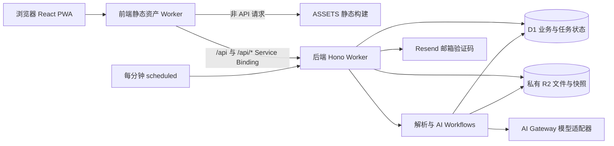

# 「补位」AI 项目办公室：实现架构与待办

更新：2026-09-30（launch_prep 分支本轮 A01–A15 推进）。当前实现包含 `3b0aaba` / `6fae48e` 的预算与恢复修复及本轮邀请制邮箱部署；19dedbd 复核结果作为历史记录保留。后续变更应同时更新本文及待办状态。

本文中的“已实现”表示代码存在；“本地已验证”指已有本地测试或浏览器证据；“待配置”“未完成”“待验证”均不能作为上线通过。历史验证详情见 [实现对齐记录](IMPLEMENTATION-ALIGNMENT.md)，需求与阶段目标见 [PLAN](../PLAN.md)。本次仅补充文档，不开展部署、发信、付费模型调用或产品功能开发。

## 1. 系统边界与部署拓扑

- 前端入口：`frontend/src/worker.ts`。API 请求原样交给 `API` Service Binding，保留 Cookie、Origin、响应状态和 Set-Cookie；其余请求交给 `ASSETS`。`frontend/wrangler.jsonc` 设置 SPA 回退，并让 API 优先经过 Worker。
- 后端入口：`backend/src/index.ts` 导出请求、scheduled 和两个 Workflow 类；`backend/src/app.ts` 注册全部 `/api/v1` 路由、请求 ID、Origin 及统一错误处理。
- 数据边界：D1 存实体、权限、revision、任务、账本及模型调用元数据；R2 存原文件、页面图、解析文本和模型输入/输出。浏览器不直接获取 R2 凭据或模型密钥。
- 环境：本地 Wrangler 模拟 D1/R2，Vite 将 `/api` 代理到 `127.0.0.1:8787`；云端分 staging 与 production，前端各自绑定对应后端服务。资源占位和真实云端验收见 [A01](#a01)。
- 游客演示：`frontend/public/guest/index.html` 保留独立原型。正式页只读取真实接口；网络或 AI 失败显示真实错误，不自动生成演示成功。

## 2. 前端结构与状态管理

| 层 | 文件 | 职责 |
| --- | --- | --- |
| 启动与路由 | `frontend/src/main.tsx`、`App.tsx` | Query/Router、懒加载页面、会话保护、401 跳转、离线和更新提示 |
| 布局 | `frontend/src/components/AppShell.tsx`、`ProjectShell.tsx` | 账户入口、项目导航、项目上下文 |
| API | `frontend/src/api/client.ts`、`types.ts`、`openapi.ts` | 同源请求、Cookie、请求 ID、幂等键、统一错误、游标列表与契约类型 |
| 身份与能力 | `frontend/src/auth.ts` | 会话、capabilities 查询及退出；页面按真实能力启用操作 |
| 草稿与最近记录 | `frontend/src/storage.ts` | localStorage 按账户/项目/材料隔离；保存失败返回明确结果；答辩最近 ID 最多 20 个 |
| 编辑与 PDF | `frontend/src/pages/MaterialsPage.tsx`、`source-pdf-render.ts` | Tiptap 正文、版本比较、离线草稿；PDF.js 按需渲染、压缩和资源释放 |
| PWA | `frontend/vite.config.ts`、`App.tsx` | 构建外壳缓存、提示式更新；runtimeCaching 为空，API 不参与 SPA 回退 |

页面按项目组织：概览、来源、要求/评分、团队、任务、AI 工作区、材料、预审、答辩、账本、设置、导出，对应 `frontend/src/pages/` 中同名页面。登录、项目列表、创建与邀请加入位于项目上下文外。

服务端数据由 TanStack Query 管理，修改成功刷新相关查询；浏览器 Query 缓存不是跨设备权威数据。会话失效会清空 Query 缓存。游标列表使用 `listAllItems`，检测重复游标并限制最多 200 页；非游标列表遵循各自契约。

材料草稿与服务端版本独立：离线时禁用提交，重连后人工检查并确认；保存时携带服务端 revision。409 保留本标签页正文并展示服务端内容，人工确认后重试。浏览器存储不可用时明确显示仅保留在页面内存。离线刷新只能恢复 PWA 外壳及明确保存的本机草稿，不能保证恢复私人 API 数据。PWA 和原生打印验收边界见 [A12](#a12)。

## 3. 后端模块与 API 契约

| 模块 | 路由文件（`backend/src/api/`） | 主要服务 / 状态 |
| --- | --- | --- |
| 系统与运维 | `health.ts`、`capabilities.ts`、`admin.ts` | 依赖健康、功能开关与限制、AI 配置版本及探测 |
| 账户与协作 | `auth.ts`、`projects.ts`、`members.ts`、`invitations.ts` | `core/auth.ts`、`auth-codes.ts`、`email/`；会话、成员、负责人权限 |
| 文件与来源 | `files.ts`、`sources.ts` | `files.ts`、`web-fetch.ts`、`parse.ts`；上传、来源版本、解析/OCR |
| 要求与评分 | `requirements.ts` | AI 草稿、人工修改/确认、引用、评分版本 |
| 任务与分工 | `tasks.ts`、`assignment.ts` | `assignment.ts`；任务、评论、建议与人工应用 |
| 材料与 AI | `materials.ts`、`agents.ts` | `tiptap.ts`、`agent.ts`；不可变版本、AI 会话、三档运行与采纳 |
| 预审与答辩 | `reviews.ts`、`rehearsals.ts` | `review.ts`、`rehearsal.ts`；固定输入版本、报告与逐题回答 |
| 过程与导出 | `ledger.ts` | `events.ts`；业务事件、JSON/Markdown 汇总 |
| 异步任务 | `jobs.ts` | `jobs.ts`、`ai-jobs.ts`、`budget.ts`、`cron.ts`；状态、派发、恢复、并发额度 |

契约由 Hono/Zod 路由生成到 `backend/openapi/openapi.json`，前端生成 `frontend/src/api/openapi.ts`。当前契约包含 60 路径、81 操作（本轮新增来源全文片段、答辩历史列表与两个幂等运维端点）；准确字段、方法与响应以该契约为准。接入步骤见 [前端集成说明](../backend/docs/FRONTEND-INTEGRATION.md)。

响应使用 data/requestId 包装；失败包含 code、message、retryable 和可选 details。异步创建接口返回任务 ID，前端通过任务查询观察状态。`409 VERSION_CONFLICT` 表示 revision 不匹配，不能静默覆盖；`409 IDEMPOTENCY_CONFLICT` 表示同键不同请求体。

`core/auth.ts` 校验 HttpOnly / Secure / SameSite=Lax Cookie，数据库只查令牌哈希，会话固定 7 天。项目接口核对真实成员及角色，子实体还需属于项目；负责人操作由后端检查，不能依赖页面按钮隐藏。成员资料更新限定当前已认证 user_id。Origin 限制由 `core/origin.ts` 处理，云端必须填入前端域名。

`services/idempotency.ts` 按用户、操作、幂等键和原始请求体哈希记录回放结果；三个冻结写请求（AI 补位创建、草稿采纳、预审发起）已强制要求 `Idempotency-Key`，缺少时返回 400。完成响应仍在业务执行后另行写入，不能宣称业务与回放记录已全部原子提交；遗留 `processing` 记录由运维核对，见 [A08](#a08)。

## 4. 数据模型与文件生命周期

迁移位于 `backend/migrations/`：`0001_init.sql` 建表，`0002_seed.sql` 写默认配置，`0003_contributions_correction.sql` 补充贡献更正关系。迁移应追加，不重写已使用迁移。

| 数据域 | D1 表 | 关系及用途 |
| --- | --- | --- |
| 账户 | `users`、`auth_challenges`、`sessions` | 用户、验证码挑战、令牌哈希与到期/撤销 |
| 项目 | `projects`、`project_members`、`invitations` | 项目 → 多成员/邀请；角色 owner/member |
| 文件与来源 | `files`、`sources`、`source_versions`、`source_pages`、`source_fragments` | 来源 → 版本 → 页/片段；file_id 关联私有原文件/页面图 |
| 要求 | `requirement_sets`、`requirements`、`rubric_versions` | 要求集草稿/确认、逐条字段状态与引用、评分版本 |
| 执行 | `tasks`、`task_links`、`comments` | 任务关联负责人及要求；评论关联业务实体 |
| 材料 | `materials`、`material_versions` | 材料保存 current_version_id/revision，版本保存正文 JSON/Markdown、作者及 AI 来源 |
| AI | `agent_sessions`、`agent_turns`、`agent_runs` | 会话 → 轮次/运行；输入版本、输出、采纳关系 |
| 评估 | `reviews`、`rehearsals`、`rehearsal_turns` | 预审报告、答辩会话及逐轮结果 |
| 活动历史 | `events` | 自动记录的业务事件；三项手工记录功能及数据表已由 0033 迁移删除 |
| 调度 | `jobs`、`job_outbox`、`idempotency_records` | 业务任务、派发记录、请求回放 |
| 配置与用量 | `ai_config_versions`、`ai_calls`、`usage_reservations`、`app_config` | 模型配置版本、调用快照指针/用量、并发预占、系统模板 |

主要业务实体按 project_id 隔离。材料版本等历史数据与当前指针分开，更新使用 revision 条件；多语句部分使用 D1 batch。材料保存与 AI 采纳的账本事件已与业务写入放进同一个 batch [A08](#a08)；请求回放响应仍是业务提交后的独立写入，滞留记录由运维端点恢复，见 [A08](#a08)。

R2 对象键由服务端生成。文件先初始化元数据，再传二进制并验证大小、扩展名、MIME/文件头；无效对象隔离并设置回收时间。下载重新检查会话与成员身份，桶保持私有。Cron 回收到期 quarantined 对象、清理过期会话/挑战、按宽限期回收孤儿 R2 对象并清理到期幂等记录；业务与账本数据不自动删除。保留策略与监控阈值见 [A13](#a13) 与部署说明第 10、11 节。

硬限制来自 `backend/src/core/limits.ts` 并由 capabilities 下发：文件 10 MiB、PDF 30 页、页面图长边 2000px / 2 MiB、列表每页最多 100、每项目并行 AI 任务 2、单次分工建议最多 20 个任务。前端能力提示不能取代服务端校验。

## 5. 关键业务流程

### 5.1 登录、项目与协作

邮箱提交 → 创建验证码挑战 → 本地 echo 或云端 Resend → 校验验证码 → 创建 Cookie 会话 → 读取真实项目。echo 仅限本地，生产/未知环境不允许回显。负责人创建邀请，成员加入后各自维护技能和投入时间。真实邮件与投递失败流程仍需云端验收 [A02](#a02)。

### 5.2 来源导入、OCR 与要求确认

1. 上传原文件、粘贴正文或提交网页 URL，创建来源及来源版本。
2. 解析任务用 unpdf 抽取 PDF 文本；TXT/Markdown、粘贴和网页走各自读取路径。普通 PDF 文本抽取不是 OCR。
3. 页文本 trim 后长度少于 20 个字符时，文件来源页标记需要页面图，任务进入 waiting_input。该启发式不能保证所有文字层质量。
4. 前端读取关联原 PDF，用 PDF.js 渲染待处理页、缩放与压缩，上传并绑定页面图；后端通过视觉模型识别，写 OCR 片段并设置 needs_review。
5. 文本模型生成结构化要求；片段 ID 必须属于来源版本，页码与引文校验，失败如实报告。成功只生成草稿，人类修改并确认要求与评分。

视觉 OCR 有实现，PDF.js 渲染有本地浏览器证据；真实中文扫描、旋转页、表格、公式及比赛原文件的识别正确性尚未通过。OCR 部分页失败能否进入完整成功要求集的边界需补验收 [A06](#a06)。全文定位界面另见 [A10](#a10)。

### 5.3 任务分工、材料与 AI 采纳

任务绑定项目成员/要求并使用 revision 更新。分工建议读取任务和成员快照，异步返回建议；人工应用单个建议时再次检查任务 revision，AI 不直接修改正式分工。

AI 三档为 `do`（代做草稿）、`guide`（引导）、`review_only`（审阅）。请求携带材料/来源版本 ID、任务和指令，运行保留输出及调用记录。生成结果需人工审阅；采纳要求 expectedRevision，创建新的 material_version 并关联 ai_run_id，更新当前版本及运行采纳状态。缺失事实使用占位，正式接口不把模拟内容写入材料。

正文保存、评论、双标签冲突和离线恢复已有本地证据；材料附件与作品介绍模板已接入版本和导出 [A09](#a09)。任务创建时冻结配置版本，各执行服务读取该版本，解析的 OCR 与要求提取也保持版本一致 [A05](#a05)。

### 5.4 预审、答辩与导出

预审使用指定材料/评分版本，AI 输出建议报告；答辩按会话逐题生成问题及反馈，保留真实轮次。答辩跨设备发现历史缺少列表接口 [A11](#a11)。活动历史展示真实业务事件，决策记录、贡献补录和第三方资源声明已移除。导出提供项目 JSON/Markdown，材料页面可打印；内容正确性由真实材料及人工核对保证，AI 报告不能代替赛事验收 [A14](#a14)。

## 6. 异步任务与模型调用

`services/jobs.ts` 在同一 D1 batch 创建 jobs 和 job_outbox，再尽力派发；解析类走 ParseSourceWorkflow，其余已接入 AI 类走 AgentRunWorkflow，实例 ID 使用 jobId。状态包括 queued、running、waiting_input、succeeded、failed、cancelled；等待页面图时 Workflow 返回，不持续占用执行等待用户。

`cron.ts` 每分钟补投到期 pending outbox，查询最多 10 项，租约 5 分钟、派发重试达到 5 次标记失败；并释放超过 2 小时的 reserved 并发额度。前端查询任务，重试 API 校验身份及任务状态。已有实例通过错误文本 `already exists` 分支处理；该分支没有查询实例状态。running 状态崩溃、重复步骤及终态一致性仍需专项验证 [A07](#a07)，不能把确定性实例 ID 等同于端到端恰好一次执行。

`ai/config.ts` 定义 textEconomy、visionEconomy、review 配置，配置以新版本追加；`ai/gateway.ts` 处理模型请求、输入上限和重试；`ai/probe.ts` 检查中文、JSON、图片和用量能力。启用状态由最新配置控制；capabilities 的 aiEnabled 不是密钥或模型可用性的实时探测。启用流程需要人工遵守探测要求 [A04](#a04)。

`ai/calls.ts` 将输入/输出存 R2，并记录模型、配置/提示版本、token、延迟和结果状态；配置了 `pricePerMTokens` 时按真实用量计算 `cost_usd`，未配置或用量缺失时如实记 unknown。`services/budget.ts` 现按「并发上限 + 项目金额预算」原子预占：按模型参数估算预占金额，调用后按该次预占窗口内的 `ai_calls` 结算；部分入口先派发后预占、失败计费与估算上界仍未闭合，费用未知记 `pending_reconcile`；OCR 与要求提取也已纳入预占，见 [A03](#a03)。Gateway 支持 `workers-ai` 与自定义 `openai-compatible` 两种供应商（后者密钥 AES-GCM 加密存储），仅 `ENV_NAME=local` 允许回环模型地址，见 [A15](#a15)。

## 7. 未完成与不确定事项登记

以下编号是可跟踪占位；负责人为建议职责，尚未指定具体人员。完成后必须补充提交及验证证据，再更新状态。

### 7.1 本轮（launch_prep）推进结果

本轮只做本地可完成的部分：**未部署云端、未向任何可能计费的 API 发送请求**。模型路径一律使用受控 fixture 或测试注入的 fetch mock。

| 编号 | 本轮结果 | 本地证据 |
| --- | --- | --- |
| A01 | 两端 `wrangler deploy --dry-run --env staging` 通过；`npm run preflight:deploy -- staging` 精确列出仍缺 3 项（EMAIL_FROM、真实 D1 database_id、前端 HTTPS Origin 白名单）并退出 1 | 本机 dry-run 与 preflight 输出 |
| A02 | Resend 适配器失败/成功路径单测（mock，不发送真实请求）：缺 Key、非 2xx、成功请求体 | `backend/test/24-email-resend.test.ts` |
| A03 | 新增项目级 `ai_budget_usd`（null=不限额）；新增估算金额与并发原子检查、用量结算和 `pending_reconcile`；OCR/要求提取纳入预占，但先派发后预占、失败计费与估算上界仍待修正 | `0006_project_ai_budget.sql`、`services/budget.ts`、`test/82-agents.test.ts` |
| A04 | 探测证据按配置版本持久化，未探测/探测失败/配置变更后均拒绝启用 | `test/20-admin-ai.test.ts` |
| A05 | 任务在创建时冻结 `configVersionId`，各执行服务按冻结版本读取；排队期间改配置不影响该任务 | `test/22-ai-routing.test.ts` |
| A06 | `stillMissing` 只统计缺图且无文本层的页；OCR 失败的页使任务失败而非误报完整；**空 OCR 文本不再被当作识别成功**；失败页重新出现在待渲染列表可重试 | `test/70-sources-parse.test.ts` |
| A07 | 终态不可被迟到回调改回；租约只允许一次抢占；运行中任务额度不被清理释放；创建 Workflow 前中断的恢复仍待补 | `test/23-job-recovery.test.ts`、`test/82-agents.test.ts` |
| A08 | 三个冻结写请求强制 `Idempotency-Key`（缺失 400）；材料保存与 AI 采纳的账本事件并入业务 D1 batch；新增滞留 `processing` 的运维接口；完全原子性与采纳冲突账本仍待补 | `test/27-idempotency-recovery.test.ts`、`test/82-agents.test.ts` |
| A09 | 材料附件随版本不可变保存、随导出返回、跨项目附件被拒绝；作品介绍模板生成结构化正文 | `test/87-a-items-coverage.test.ts`、`test/80-tasks-materials.test.ts` |
| A10 | 来源全文片段分页接口 + 引用 `fragmentId` 定位；跨项目 403、非法游标 400 | `test/87-a-items-coverage.test.ts` |
| A11 | 答辩历史列表接口（游标分页、成员权限） | `test/87-a-items-coverage.test.ts` |
| A12 | 已补齐安装图标与应用内安装入口；**仍需人工**在操作系统完成实际安装与 Chrome 原生「另存为 PDF」 | `frontend/src/pwa-install.test.ts`（5 例）、构建产物 manifest 与 `dist/index.html` |
| A13 | GC 与保留策略、本地恢复演练和预算竞争测试已有实现；云端执行与长期监控待验收 | `test/25-gc-retention.test.ts`、`test/26-budget-stress.test.ts`、`scripts/backup-drill-local.mjs` |
| A14 | 本地零费用全链路（来源解析→要求确认→AI 代做→采纳→导出）在真实 D1/R2/Workflow 代码路径上通过，模型为受控 fixture | `test/90-e2e-local.test.ts` |
| A15 | 自定义 `openai-compatible` 供应商（URL + 加密密钥）、`workers-ai` 分支、地址安全策略与本地回环例外 | `test/22-ai-routing.test.ts`、`test/20-admin-ai.test.ts` |

**仍未完成**：A03 调用前金额门槛/失败计费、A07 创建中断恢复、A08 冲突账本与完全原子性；A01 云端部署与资源验收、A02 真实投递、A07 云端故障演练、A12 操作系统级交互、A13 云端压测与长期监控、A14 真模型与比赛原始材料验收。

### 7.2 已知运行时现象与结论

- **workerd `canceled request` / `RPC stub not disposed` 提示（A13）**：来自 `@cloudflare/vitest-pool-workers` 的工作流内省器收尾——它会对实例调用 `unsafeAbort`，且 `unsafeGetInstanceModifier` 的 RPC 结果由库自身持有。仅等待 `complete` 会在负向用例（实例停在 `errored`）超时后 abort。曾试过并发等待 `complete/errored/terminated`，因遗留待决 RPC 调用把告警从 5 条放大到 44 条，故保留单一终态等待并如实记录日志，不隐藏。
- **本地回环模型地址**：`isAllowedModelEndpoint` 在 `ENV_NAME=local` 时允许 http/https 回环地址，用于零费用联调；但实测 `wrangler dev` 本地运行时不会把出站 fetch 路由到宿主机回环端口（stub 服务收不到任何请求），因此本地零费用端到端改用测试运行时注入的 fetch mock，而不是宿主机 stub 服务。云端环境仍强制公网 HTTPS。

### A01 · 云资源与正式部署【生产已部署；staging/域名自动化与故障演练待验收】

- 位置：`backend/wrangler.jsonc`、`frontend/wrangler.jsonc`、`backend/docs/DEPLOY.md`。
- 当前仓库：production 已填入 D1 ID、R2 桶、Account ID、Origin 与 EMAIL_FROM，前端 `greenbp-team-office` 的 API 绑定指向 `greenbp-team-office-backend`；生产静态预检通过。staging 仍缺 D1 ID、Origin、EMAIL_FROM。Gateway ID 留空；也可在网页设置自定义兼容接口。本轮已核对并部署生产 Secrets、资源绑定和迁移，D1/R2 健康；历史账户检查不能代替本轮证据。
- 完成判据：运维填入环境资源、应用迁移、部署两端，验证同源登录、权限、R2、Workflows、Cron、回滚和云端全流程；留存环境与提交记录。

### A02 · 真实邮箱投递【生产主路径已验证】

- 位置：`backend/src/email/`、`backend/src/api/auth.ts`、部署 Secrets。
- 完成判据：配置 Resend Key/已验证发信域名，真实邮箱收到验证码；过期、重发、错误次数及供应商失败路径通过；云端无 OTP 回显。

### A03 · 金额预算与费用结算【调用前门槛与失败计费已修复；真账单待验证】

- 位置：`backend/src/ai/calls.ts`、`services/budget.ts`、`api/projects.ts`、迁移 `0006_project_ai_budget.sql`、`usage_reservations`。
- 本轮实现：项目级 `ai_budget_usd`（null=不限额）；配置了 `pricePerMTokens` 且 token 已知时按真实用量计算 `cost_usd`，否则记 `unknown`；`budget.ts` 用单条 `INSERT…SELECT` 原子完成「并发上限 + 剩余预算」检查并写入估算金额（输入按 `maxInputChars/4` 估 token、输出按 `maxOutputTokens` 估算；此估算不是中文输入、修复重试与多页 OCR 的最坏情况上界），调用后按该次预占窗口内的 `ai_calls` 结算，存在费用未知调用则记 `pending_reconcile`；OCR 与要求提取已纳入预占。价格未知时估算为 0，仅受并发上限约束。
- 已修复：所有入口使用冻结配置先预占后派发，真实 fetch 前标记 attempts_started，并按 reservation_id 归属费用；失败释放自动按已发生调用结算，未知费用保留 pending_reconcile。有限预算拒绝未知价格、OCR 和非 Workers 接口；文本估算是规划金额，仍需真实供应商账单核对。
- 完成判据：后端/产品确定计费规则，调用前原子检查并预占金额，成功/失败/重试/超时均结算或待对账；重复执行不重复扣款，预算竞争测试及供应商账单核对通过。

### A04 · 模型探测启用门槛【已实现（本地）；真模型探测待云端】

- 位置：`backend/src/api/admin.ts`、`ai/probe.ts`、迁移 `0004_ai_probes.sql`。
- 本轮实现：探测结果按 `(config_version_id, purpose)` 持久化；写 `enabled=true` 时要求配置与最新版本完全一致且该版本三用途均有 `passed=1` 证据，否则 409。缺密钥或模型不可用时探测报告与 `ai_calls` 如实记失败。
- 完成判据：未探测、失败或配置已变化时拒绝启用；textEconomy/visionEconomy/review 真模型能力证据齐全，缺密钥/模型不可用明确报错。

### A05 · 任务冻结模型配置【已实现（本地）】

- 位置：`backend/src/services/jobs.ts`、`parse.ts`、`agent.ts`、`assignment.ts`、`review.ts`、`rehearsal.ts`。
- 本轮实现：创建任务时解析并写入 `configVersionId`（与 outbox 同 batch），执行侧一律按冻结版本读取；解析类通过 `source_versions.ai_config_version_id` 在 OCR→要求提取多阶段间保持一致。证据：`backend/test/22-ai-routing.test.ts`。
- 完成判据：创建任务冻结配置；排队、重试及 OCR 多阶段继续均使用约定版本；执行中修改管理员配置的回归测试通过。

### A06 · OCR 完整性与原始材料识别【逻辑已实现（本地）；真实识别质量待云端】

- 位置：`backend/src/services/parse.ts`、`api/sources.ts`、`frontend/src/pages/SourceFullText.tsx`。
- 本轮实现：`stillMissing` 只统计 `image_status='none' AND text_status='none'` 的页（混合 PDF 的已有文本页不再导致持续等待）；提取前检查 `text_status='none' AND ocr_status!='ok'` 的页并使任务以 `AI_OUTPUT_INVALID` 失败，失败页重新出现在 `render-requests` 可重试；**空 OCR 文本不再被视为识别成功**（此前会跳过失败页并误报「来源没有可分析的文本内容」）。证据：`backend/test/70-sources-parse.test.ts`。
- 仍需云端：中文扫描、旋转、表格、公式与加密/损坏 PDF 的真实识别质量。
- 完成判据：真模型处理中文扫描、旋转、表格、公式、混合文字层、加密/损坏 PDF；失败页明确可见、可重试或人工补录，未完整复核不得误报完整；比赛原文逐条引用人工核对。

### A07 · Workflow 恢复与重复执行边界【创建中断本地回归通过；云端故障演练待验收】

- 位置：`backend/src/services/jobs.ts`、`cron.ts`、`workflows/`、各业务执行服务。
- 本轮实现：outbox 租约抢占检查条件更新影响行数；`already exists` 分支改为查询引擎实例状态（`reconcileWorkflowJob`），实例已结束但业务未提交时标记失败并释放额度；`succeedJob`/`failJob` 仅在 queued/running 时生效，终态不可被迟到回调改回；cron 每轮核对超过 5 分钟的 running 任务。证据：`backend/test/23-job-recovery.test.ts`。
- 已修复该窗口：missing 实例且未开始调用时以 CAS 原子重排，并同轮补投；已开始调用则失败并按实际费用结算，不重复发出模型请求。仍需真实云端创建中断、步骤重放与取消竞争演练。
- 完成判据：故障注入覆盖创建后断电、派发异常、步骤重放、终态与取消竞争、租约到期；不会永久卡住、重复产生正式结果或复用已结束实例导致假成功。

### A08 · 业务、账本和幂等响应原子性【强制键已实现；完全原子性仍未完成】

- 位置：`backend/src/services/idempotency.ts`、`api/materials.ts`、`api/agents.ts`、`api/reviews.ts`、`services/events.ts`。
- 本轮实现：三个冻结写请求（AI 补位创建、草稿采纳、预审发起）强制 `Idempotency-Key`，缺失返回 400；材料保存与 AI 采纳（`material.adopted`）的账本事件均移入与业务写入同一个 D1 batch，业务成功即事件必在；幂等 `processing` 记录不再被 10 分钟规则自动删除（业务可能已成功）。
- 运维恢复路径：新增 `GET /api/v1/admin/idempotency/stuck`（按 `olderThanMinutes`/`limit` 列出滞留记录，0 表示不过滤时长）与 `POST /api/v1/admin/idempotency/release`（人工确认业务状态后释放该键以便重试），需 `ADMIN_TOKEN`。
- 状态模拟证据：`backend/test/27-idempotency-recovery.test.ts` 在成功请求后人工将回放记录退回 processing，验证「业务成功而响应记录失败」后，同键重试返回 409 且**不重复建版本、不丢账本事件**；运维释放后重试同样不产生重复版本；正常回放返回原响应且不新增版本。
- **未关闭边界**：回放响应记录仍在业务批次提交之后写入，二者不是同一事务，极端情况下会留下 `processing` 记录，需按运维路径处理，而不是自动删除后重复执行。
- 采纳幽灵事件窗口已修复：条件 INSERT/UPDATE 串联在同一 batch，并发失败不产生版本、事件或改动其它采纳。响应回放仍是业务提交后的独立写入，保留人工恢复边界。
- 完成判据：业务成功而响应/账本写入失败后，同键重试不重复建版本、不丢事件；关键写入明确强制键或替代策略。故障注入测试证明恢复语义，修正与代码不符的旧注释。

### A09 · 材料附件和作品介绍结构模板【已实现（本地）】

- 位置：`frontend/src/pages/MaterialAttachments.tsx`、`MaterialsPage.tsx`、`backend/src/api/materials.ts`、迁移 `0005_material_attachments.sql`。
- 本轮实现：附件以 `material_versions.attachments_json` 随版本不可变保存，历史版本保留各自附件；`PUT /materials/{id}` 接受 `attachmentIds`（最多 20 个，校验属于本项目且 `status='available'`，跨项目 404），`files.original_name` 记录展示名；附件随 `export-bundle` 返回；`kind='work-introduction'` 生成结构化作品介绍正文。证据：`backend/test/80-tasks-materials.test.ts`、`87-a-items-coverage.test.ts`。
- 完成判据：正式 UI/API 支持关联附件及模板字段，历史版本和导出包含对应数据，越权及缺字段检查通过。

### A10 · 来源全文片段定位【已实现（本地）】

- 位置：`backend/src/api/sources.ts`、`frontend/src/pages/SourceFullText.tsx`、`SourcesPage.tsx`、`RequirementsPage.tsx`。
- 本轮实现：新增 `GET /projects/{id}/sources/{sid}/versions/{vid}/fragments`（游标分页，逐条校验来源版本归属）；要求引用链接携带 `fragmentId`，前端展开全文、支持搜索并按 `fragmentId` 滚动高亮；非法游标 400、跨项目 403。证据：`backend/test/87-a-items-coverage.test.ts`。
- 完成判据：从要求引用定位对应版本、页/片段和原文，失效/缺文件状态明确；跨版本不跳错原文。

### A11 · 答辩历史跨设备列表【已实现（本地）】

- 位置：`backend/src/api/rehearsals.ts`、`frontend/src/pages/RehearsalsPage.tsx`。
- 本轮实现：新增 `GET /projects/{id}/rehearsals`（游标分页、成员校验），前端把服务端历史与本机最近记录合并展示；OpenAPI 类型已重新生成。证据：`backend/test/87-a-items-coverage.test.ts`。
- 完成判据：新设备登录可列出并恢复有权限会话，分页和成员权限验证通过，更新 OpenAPI 类型。

### A12 · PWA 安装与原生 PDF 保存【待验证】

- 位置：`frontend/vite.config.ts`、`frontend/index.html`、`frontend/public/icon-*.png`、`frontend/src/pwa-install.ts`、`App.tsx`、`pages/ExportPage.tsx`、`MaterialsPage.tsx`。
- 本轮实现：补齐 192/512 PNG 与独立 maskable 图标、manifest `lang=zh-CN`、`apple-touch-icon`（此前仅有 `sizes:any` 的 SVG，Chrome 安装性检查对 SVG 尺寸声明存在版本差异）；新增应用内安装入口 `frontend/src/pwa-install.ts`（捕获 `beforeinstallprompt`/`appinstalled`，standalone 模式下不提供）并在 PwaStatus 区域显示「安装到桌面」按钮。证据：`frontend/src/pwa-install.test.ts`（5 例）、构建产物 manifest 与 `dist/index.html`。
- 仍待人工：操作系统级实际安装/独立启动、Chrome 原生“另存为 PDF”完整交互、真实断网刷新与点击“立即更新”。

### A13 · 运维、清理、压测和测试告警【本地已完成；云端压测与长期运行待验证】

- 位置：`backend/src/services/gc.ts`、`cron.ts`、`core/limits.ts`、`backend/test/`、`backend/docs/DEPLOY.md`、`scripts/backup-drill-local.mjs`。
- 本轮实现：新增孤儿 R2 对象回收（只处理已知受管键 `ai-calls/{id}/…`、`sources/{vid}/…`、`{projectId}/{fileId}{ext}`；只删除数据库无引用且超过 7 天宽限期的对象；单轮最多 200 个；支持 dryRun 预演）与已完成幂等记录 30 天清理（`processing` 不自动删除）；保留策略、监控阈值与恢复步骤写入 `backend/docs/DEPLOY.md` 第 9–11 节；本地备份/恢复演练脚本 `npm run backup:drill:local` 已实测通过（导出 → 完整性校验 → 建表前置重排 → 导入独立本地库 → 查询验证，仅用 `--local`）。证据：`backend/test/25-gc-retention.test.ts`（清理不误删有效对象、dryRun 不落删）、`26-budget-stress.test.ts`（12 并发严格限 2、承诺金额不超预算、预算 0 拒绝）。
- 测试运行时告警：已定位为 `@cloudflare/vitest-pool-workers` 工作流内省器收尾所致（对实例 `unsafeAbort`，且库自身持有 `unsafeGetInstanceModifier` 的 RPC 结果），可复现依据见 7.2。
- 仍需云端：真实数据量下的清理与压测、长期运行监控。
- 完成判据：确定保留策略并验证清理不会删有效对象；恢复演练及监控证据齐全；完成预算竞争测试。历史后端测试通过但仍出现 workerd canceled request / RPC stub dispose 告警，需定位并消除或提供可复现的运行时问题依据，不隐藏日志。

### A14 · 比赛材料与真模型端到端验收【待验证】

- 位置：`PLAN.md`、来源/要求/评分、AI/预审/答辩与导出页面。
- 占位：真实比赛通知、确认要求、最终作品/PDF/视频及人工验收记录。
- 完成判据：来源→OCR→要求确认→分工→三档 AI→采纳→预审→答辩→导出全程走真实云接口/模型，关键事实和引用人工核对，最终材料按确认规则验收；fixture 成功不计入真模型验收。

### A15 · 模型供应商切换【已实现（本地）；真实第三方探测待云端】

- 位置：`backend/src/ai/config.ts`、`gateway.ts`、`ai/secrets.ts`、`api/admin.ts`。
- 本轮实现：`provider !== 'workers-ai'` 走自定义分支，使用配置中的 `apiUrl` 与 AES-GCM 加密保存的 `apiKey`（调用时解密，接口不回显密文）；`workers-ai` 分支继续使用 Gateway REST 与 `cf-aig-gateway-id`；地址策略云端强制公网 HTTPS（禁 userinfo/query/hash 与内网/本机地址），仅 `ENV_NAME=local` 允许回环地址。证据：`backend/test/22-ai-routing.test.ts`、`20-admin-ai.test.ts`。
- 完成判据：明确支持供应商及密钥配置，实际适配地址/输出/用量；每个用途真模型探测通过。图片探测的 1×1 样本只能证明请求格式被接受，不能证明中文 OCR 质量。

## 8. 验证方式与维护约定

文档依据源码及已有验收报告，不将历史测试计数或历史云账户状态当作实时验证。本轮文档检查记录见提交；后续功能改动应执行根 README 的 typecheck、lint、前后端测试、build 和 verify:worker。HTTP 集成脚本须先启动本地两端，仅允许 loopback + local + echo，不能用于生产验收或真模型验收。

已有本地覆盖包含真实 Workers/D1/R2 HTTP 联调、成员隔离、材料冲突/离线、PDF.js 渲染、下载证据及 API 转发；模型成功测试使用受控 fixture。具体命令、测试运行告警、截图和样本见 [实现对齐记录](IMPLEMENTATION-ALIGNMENT.md) 与 [PDF 渲染复现](../frontend/verification/README.md)。部署步骤见 [部署说明](../backend/docs/DEPLOY.md)，涉及供应商、价格、权限及能力时须在实际执行前复核官方文档和账户。

待办关闭时记录：实现提交、验证环境、执行命令/操作、观察结果及证据链接。不得仅删除占位或将“配置存在”改写为“功能已验收”。

### 历史文档交付验证（2026-09-30，功能更新前）

- README 与本文的 37 个本地链接/锚点、引用的完整代码路径、代码块闭合及 A01–A15 唯一性检查通过。
- 对当前 OpenAPI JSON 计数：60 路径 / 81 操作，与本文一致（本轮新增来源全文片段、答辩历史列表与两个幂等运维端点）。
- `npm run typecheck` 前后端通过；`npm run lint` 前端通过，无 lint 告警；`git diff --check` 通过。
- 本次仅修改两份 Markdown，未重跑产品测试、构建、浏览器或云端验收；既有业务测试结论仍以对齐报告标注的历史环境为准。

### 19dedbd 进度复核补记

本次核对两个新增提交并重跑本地检查：后端 25/109、前端 15/43 通过，typecheck/lint/build/verify:worker 通过；production 静态预检通过，staging 仍有三项配置阻碍。A03/A07/A08 上述缺口来自源码核对，现有通过的测试没有覆盖这些窗口。本次只更新进度文档，未修改业务代码、未部署、未调用真实邮件或模型。

## 9. 邮箱上线与剩余验收补记（2026-09-30）

本轮在当前 `main` 分支合入 `3b0aaba`（预算先预占、费用归属、原子采纳）和 `6fae48e`（缺失 Workflow 恢复），并部署邮箱邀请制。前面 19dedbd 复核中列出的先派发后预占、失败直接释放、缺失实例不恢复及采纳幽灵事件均已按新实现修复；保留真实供应商计费和云端故障演练边界。

- A01：生产两端、D1/R2 依赖、Service Binding、0008/0009/0010/0011 迁移与 Cron/Workflow 绑定已部署；备用入口实际可用。自定义域名对自动化请求仍 challenge，staging 尚未配置。
- A02：Resend 子域 Verified、真实邮件 Delivered、用户确认实际登录，生产 Cookie 的 HttpOnly/Secure/SameSite=Lax 已实测。当前用户明确选择邀请制，名单为 Secret，公开注册未开启。限流采用独立持久化全站/邮箱日额度与 IP 小时记录，清理验证码不会重置限额。
- A03：所有 AI 入口先冻结/预占后派发；调用开始与 reservation_id 持久化，invalid 响应真实 token 也结算，未落账费用保留 pending_reconcile；该状态不占运行槽位，但有限预算有待对账时拒绝新调用。有限预算拒绝未知价格、OCR/图片与非 Workers 兼容接口。金额为受限文本请求的规划估算，不承诺供应商账单硬上限。
- A07：未开始模型调用的 missing 实例原子重排，同轮 Cron 补投；已有调用/开始标记则失败并结算，避免重复费用；仍需真实云端故障注入。
- A08：采纳条件 INSERT/UPDATE 链保证并发失败不留下版本、事件或撤销其它采纳。响应回放仍在业务 batch 后写入，完全原子性边界保留，必要时人工恢复 processing。
- A09/A10/A11：本地覆盖保持；生产材料模板、r2 保存、刷新和导出预览已验证。原生 JSON 下载等待超时，不能视为保存通过。
- A12：生产网页的「立即更新」已实际点击并加载新版本；操作系统 PWA 安装和原生 PDF 保存仍待人工。
- A13：30 张表的本地恢复演练与预算/邮件配额竞争测试通过；生产迁移前私有备份已保存。新增外键造成导出 DDL 结束格式变化的恢复脚本问题已修复。仍需云端恢复切换、长期监控与压力验证。
- A14/A15：真实模型/OCR 未调用，URL/key 仍留待用户在网页填写；142 后端与 48 前端断言通过不能代替真模型验收。

未来 VPS 前端/代理方案已准备并离线验证，实际服务器、DNS/TLS切换与可信 IP 传递仍未完成；见部署说明第 14 节。
