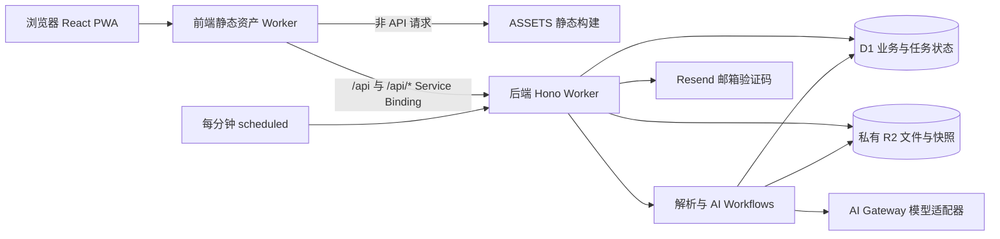

# 「补位」AI 项目办公室：实现架构与待办

更新：2026-09-30。核对基线：`42932c9`，本文记录该提交的实际代码结构。后续变更应同时更新本文及待办状态。

本文中的“已实现”表示代码存在；“本地已验证”指已有本地测试或浏览器证据；“待配置”“未完成”“待验证”均不能作为上线通过。历史验证详情见 [实现对齐记录](IMPLEMENTATION-ALIGNMENT.md)，需求与阶段目标见 [PLAN](../PLAN.md)。本次仅补充文档，不开展部署、发信、付费模型调用或产品功能开发。

## 1. 系统边界与部署拓扑

- 前端入口：`frontend/src/worker.ts`。API 请求原样交给 `API` Service Binding，保留 Cookie、Origin、响应状态和 Set-Cookie；其余请求交给 `ASSETS`。`frontend/wrangler.jsonc` 设置 SPA 回退，并让 API 优先经过 Worker。
- 后端入口：`backend/src/index.ts` 导出请求、scheduled 和两个 Workflow 类；`backend/src/app.ts` 注册全部 `/api/v1` 路由、请求 ID、Origin 及统一错误处理。
- 数据边界：D1 存实体、权限、revision、任务、账本及模型调用元数据；R2 存原文件、页面图、解析文本和模型输入/输出。浏览器不直接获取 R2 凭据或模型密钥。
- 环境：本地 Wrangler 模拟 D1/R2，Vite 将 `/api` 代理到 `127.0.0.1:8787`；云端分 staging 与 production，前端各自绑定对应后端服务。资源占位和真实云端验收见 [A01](#a01)。
- 游客演示：`frontend/public/guest/index.html` 保留独立原型。正式页只读取真实接口；网络或 AI 失败显示真实错误，不自动生成演示成功。

## 2. 前端结构与状态管理

| 层 | 文件 | 职责 |
| --- | --- | --- |
| 启动与路由 | `frontend/src/main.tsx`、`App.tsx` | Query/Router、懒加载页面、会话保护、401 跳转、离线和更新提示 |
| 布局 | `frontend/src/components/AppShell.tsx`、`ProjectShell.tsx` | 账户入口、项目导航、项目上下文 |
| API | `frontend/src/api/client.ts`、`types.ts`、`openapi.ts` | 同源请求、Cookie、请求 ID、幂等键、统一错误、游标列表与契约类型 |
| 身份与能力 | `frontend/src/auth.ts` | 会话、capabilities 查询及退出；页面按真实能力启用操作 |
| 草稿与最近记录 | `frontend/src/storage.ts` | localStorage 按账户/项目/材料隔离；保存失败返回明确结果；答辩最近 ID 最多 20 个 |
| 编辑与 PDF | `frontend/src/pages/MaterialsPage.tsx`、`source-pdf-render.ts` | Tiptap 正文、版本比较、离线草稿；PDF.js 按需渲染、压缩和资源释放 |
| PWA | `frontend/vite.config.ts`、`App.tsx` | 构建外壳缓存、提示式更新；runtimeCaching 为空，API 不参与 SPA 回退 |

页面按项目组织：概览、来源、要求/评分、团队、任务、AI 工作区、材料、预审、答辩、账本、设置、导出，对应 `frontend/src/pages/` 中同名页面。登录、项目列表、创建与邀请加入位于项目上下文外。

服务端数据由 TanStack Query 管理，修改成功刷新相关查询；浏览器 Query 缓存不是跨设备权威数据。会话失效会清空 Query 缓存。游标列表使用 `listAllItems`，检测重复游标并限制最多 200 页；非游标列表遵循各自契约。

材料草稿与服务端版本独立：离线时禁用提交，重连后人工检查并确认；保存时携带服务端 revision。409 保留本标签页正文并展示服务端内容，人工确认后重试。浏览器存储不可用时明确显示仅保留在页面内存。离线刷新只能恢复 PWA 外壳及明确保存的本机草稿，不能保证恢复私人 API 数据。PWA 和原生打印验收边界见 [A12](#a12)。

## 3. 后端模块与 API 契约

| 模块 | 路由文件（`backend/src/api/`） | 主要服务 / 状态 |
| --- | --- | --- |
| 系统与运维 | `health.ts`、`capabilities.ts`、`admin.ts` | 依赖健康、功能开关与限制、AI 配置版本及探测 |
| 账户与协作 | `auth.ts`、`projects.ts`、`members.ts`、`invitations.ts` | `core/auth.ts`、`auth-codes.ts`、`email/`；会话、成员、负责人权限 |
| 文件与来源 | `files.ts`、`sources.ts` | `files.ts`、`web-fetch.ts`、`parse.ts`；上传、来源版本、解析/OCR |
| 要求与评分 | `requirements.ts` | AI 草稿、人工修改/确认、引用、评分版本 |
| 任务与分工 | `tasks.ts`、`assignment.ts` | `assignment.ts`；任务、评论、建议与人工应用 |
| 材料与 AI | `materials.ts`、`agents.ts` | `tiptap.ts`、`agent.ts`；不可变版本、AI 会话、三档运行与采纳 |
| 预审与答辩 | `reviews.ts`、`rehearsals.ts` | `review.ts`、`rehearsal.ts`；固定输入版本、报告与逐题回答 |
| 过程与导出 | `ledger.ts` | `events.ts`；事件、决策、贡献及更正、资源引用、JSON/Markdown 汇总 |
| 异步任务 | `jobs.ts` | `jobs.ts`、`ai-jobs.ts`、`budget.ts`、`cron.ts`；状态、派发、恢复、并发额度 |

契约由 Hono/Zod 路由生成到 `backend/openapi/openapi.json`，前端生成 `frontend/src/api/openapi.ts`。核对基线包含 57 路径、77 操作；准确字段、方法与响应以该契约为准。接入步骤见 [前端集成说明](../backend/docs/FRONTEND-INTEGRATION.md)。

响应使用 data/requestId 包装；失败包含 code、message、retryable 和可选 details。异步创建接口返回任务 ID，前端通过任务查询观察状态。`409 VERSION_CONFLICT` 表示 revision 不匹配，不能静默覆盖；`409 IDEMPOTENCY_CONFLICT` 表示同键不同请求体。

`core/auth.ts` 校验 HttpOnly / Secure / SameSite=Lax Cookie，数据库只查令牌哈希，会话固定 7 天。项目接口核对真实成员及角色，子实体还需属于项目；负责人操作由后端检查，不能依赖页面按钮隐藏。成员资料更新限定当前已认证 user_id。Origin 限制由 `core/origin.ts` 处理，云端必须填入前端域名。

`services/idempotency.ts` 按用户、操作、幂等键和原始请求体哈希记录回放结果；缺少键仍会执行，并非强制幂等。完成响应在业务执行后另行写入，不能宣称业务与回放记录已全部原子提交，见 [A08](#a08)。

## 4. 数据模型与文件生命周期

迁移位于 `backend/migrations/`：`0001_init.sql` 建表，`0002_seed.sql` 写默认配置，`0003_contributions_correction.sql` 补充贡献更正关系。迁移应追加，不重写已使用迁移。

| 数据域 | D1 表 | 关系及用途 |
| --- | --- | --- |
| 账户 | `users`、`auth_challenges`、`sessions` | 用户、验证码挑战、令牌哈希与到期/撤销 |
| 项目 | `projects`、`project_members`、`invitations` | 项目 → 多成员/邀请；角色 owner/member |
| 文件与来源 | `files`、`sources`、`source_versions`、`source_pages`、`source_fragments` | 来源 → 版本 → 页/片段；file_id 关联私有原文件/页面图 |
| 要求 | `requirement_sets`、`requirements`、`rubric_versions` | 要求集草稿/确认、逐条字段状态与引用、评分版本 |
| 执行 | `tasks`、`task_links`、`comments` | 任务关联负责人及要求；评论关联业务实体 |
| 材料 | `materials`、`material_versions` | 材料保存 current_version_id/revision，版本保存正文 JSON/Markdown、作者及 AI 来源 |
| AI | `agent_sessions`、`agent_turns`、`agent_runs` | 会话 → 轮次/运行；输入版本、输出、采纳关系 |
| 评估 | `reviews`、`rehearsals`、`rehearsal_turns` | 预审报告、答辩会话及逐轮结果 |
| 账本 | `events`、`decisions`、`contributions`、`resource_references` | 业务事件、人工决策/贡献、更正与资源引用 |
| 调度 | `jobs`、`job_outbox`、`idempotency_records` | 业务任务、派发记录、请求回放 |
| 配置与用量 | `ai_config_versions`、`ai_calls`、`usage_reservations`、`app_config` | 模型配置版本、调用快照指针/用量、并发预占、系统模板 |

主要业务实体按 project_id 隔离。材料版本等历史数据与当前指针分开，更新使用 revision 条件；多语句部分使用 D1 batch。账本和请求回放有独立写入路径，原子性边界待补齐 [A08](#a08)。

R2 对象键由服务端生成。文件先初始化元数据，再传二进制并验证大小、扩展名、MIME/文件头；无效对象隔离并设置回收时间。下载重新检查会话与成员身份，桶保持私有。Cron 回收到期 quarantined 对象并清理过期会话/挑战；完整孤儿对象、快照和归档数据保留策略尚未定义，见 [A13](#a13)。

硬限制来自 `backend/src/core/limits.ts` 并由 capabilities 下发：文件 10 MiB、PDF 30 页、页面图长边 2000px / 2 MiB、列表每页最多 100、每项目并行 AI 任务 2、单次分工建议最多 20 个任务。前端能力提示不能取代服务端校验。

## 5. 关键业务流程

### 5.1 登录、项目与协作

邮箱提交 → 创建验证码挑战 → 本地 echo 或云端 Resend → 校验验证码 → 创建 Cookie 会话 → 读取真实项目。echo 仅限本地，生产/未知环境不允许回显。负责人创建邀请，成员加入后各自维护技能和投入时间。真实邮件与投递失败流程仍需云端验收 [A02](#a02)。

### 5.2 来源导入、OCR 与要求确认

1. 上传原文件、粘贴正文或提交网页 URL，创建来源及来源版本。
2. 解析任务用 unpdf 抽取 PDF 文本；TXT/Markdown、粘贴和网页走各自读取路径。普通 PDF 文本抽取不是 OCR。
3. 页文本 trim 后长度少于 20 个字符时，文件来源页标记需要页面图，任务进入 waiting_input。该启发式不能保证所有文字层质量。
4. 前端读取关联原 PDF，用 PDF.js 渲染待处理页、缩放与压缩，上传并绑定页面图；后端通过视觉模型识别，写 OCR 片段并设置 needs_review。
5. 文本模型生成结构化要求；片段 ID 必须属于来源版本，页码与引文校验，失败如实报告。成功只生成草稿，人类修改并确认要求与评分。

视觉 OCR 有实现，PDF.js 渲染有本地浏览器证据；真实中文扫描、旋转页、表格、公式及比赛原文件的识别正确性尚未通过。OCR 部分页失败能否进入完整成功要求集的边界需补验收 [A06](#a06)。全文定位界面另见 [A10](#a10)。

### 5.3 任务分工、材料与 AI 采纳

任务绑定项目成员/要求并使用 revision 更新。分工建议读取任务和成员快照，异步返回建议；人工应用单个建议时再次检查任务 revision，AI 不直接修改正式分工。

AI 三档为 `do`（代做草稿）、`guide`（引导）、`review_only`（审阅）。请求携带材料/来源版本 ID、任务和指令，运行保留输出及调用记录。生成结果需人工审阅；采纳要求 expectedRevision，创建新的 material_version 并关联 ai_run_id，更新当前版本及运行采纳状态。缺失事实使用占位，正式接口不把模拟内容写入材料。

正文保存、评论、双标签冲突和离线恢复已有本地证据；材料附件和作品介绍模板尚未完整实现 [A09](#a09)。业务版本快照与模型配置冻结不同：执行服务读取最新模型配置，不能保证排队期间模型不变 [A05](#a05)。

### 5.4 预审、答辩与导出

预审使用指定材料/评分版本，AI 输出建议报告；答辩按会话逐题生成问题及反馈，保留真实轮次。答辩跨设备发现历史缺少列表接口 [A11](#a11)。账本汇总真实事件、决策、贡献及资源；贡献更正保留关系。导出提供项目 JSON/Markdown，材料页面可打印；内容正确性由真实材料及人工核对保证，AI 报告不能代替赛事验收 [A14](#a14)。

## 6. 异步任务与模型调用

`services/jobs.ts` 在同一 D1 batch 创建 jobs 和 job_outbox，再尽力派发；解析类走 ParseSourceWorkflow，其余已接入 AI 类走 AgentRunWorkflow，实例 ID 使用 jobId。状态包括 queued、running、waiting_input、succeeded、failed、cancelled；等待页面图时 Workflow 返回，不持续占用执行等待用户。

`cron.ts` 每分钟补投到期 pending outbox，查询最多 10 项，租约 5 分钟、派发重试达到 5 次标记失败；并释放超过 2 小时的 reserved 并发额度。前端查询任务，重试 API 校验身份及任务状态。已有实例通过错误文本 `already exists` 分支处理；该分支没有查询实例状态。running 状态崩溃、重复步骤及终态一致性仍需专项验证 [A07](#a07)，不能把确定性实例 ID 等同于端到端恰好一次执行。

`ai/config.ts` 定义 textEconomy、visionEconomy、review 配置，配置以新版本追加；`ai/gateway.ts` 处理模型请求、输入上限和重试；`ai/probe.ts` 检查中文、JSON、图片和用量能力。启用状态由最新配置控制；capabilities 的 aiEnabled 不是密钥或模型可用性的实时探测。启用流程需要人工遵守探测要求 [A04](#a04)。

`ai/calls.ts` 将输入/输出存 R2，并记录模型、配置/提示版本、token、延迟和结果状态；费用固定为 null/unknown。`services/budget.ts` 实现并发预占与释放，estimated_cost 固定为 0，不是金额预算预占或费用结算；OCR/要求提取未使用该并发预占，因此上限也未覆盖全部 AI 调用 [A03](#a03)。Gateway 目前固定使用 Workers AI 兼容地址，供应商切换见 [A15](#a15)。

## 7. 未完成与不确定事项登记

以下编号是可跟踪占位；不代表本次已实施修复。负责人为建议职责，尚未指定具体人员。完成后必须补充提交及验证证据，再更新状态。

### A01 · 云资源与正式部署【待配置 / 待验证】

- 位置：`backend/wrangler.jsonc`、`frontend/wrangler.jsonc`、`backend/docs/DEPLOY.md`。
- 占位：STAGING_D1_ID / PROD_D1_ID、ALLOWED_ORIGINS、Account/Gateway、Secrets、EMAIL_FROM 及真实服务绑定。此前账户检查是历史证据，不能视为当前账户状态。
- 完成判据：运维填入环境资源、应用迁移、部署两端，验证同源登录、权限、R2、Workflows、Cron、回滚和云端全流程；留存环境与提交记录。

### A02 · 真实邮箱投递【待配置 / 待验证】

- 位置：`backend/src/email/`、`backend/src/api/auth.ts`、部署 Secrets。
- 完成判据：配置 Resend Key/已验证发信域名，真实邮箱收到验证码；过期、重发、错误次数及供应商失败路径通过；云端无 OTP 回显。

### A03 · 金额预算与费用结算【未完成】

- 位置：`backend/src/ai/calls.ts`、`services/budget.ts`、`api/ledger.ts`、`usage_reservations`。
- 占位：价格来源/版本、币种、预估金额、项目预算、结算和未知费用对账规则，以及 OCR/要求提取的额度覆盖。目前即使配置价格也未计算 cost_usd，不能显示为零费用。
- 完成判据：后端/产品确定计费规则，调用前原子检查并预占金额，成功/失败/重试/超时均结算或待对账；重复执行不重复扣款，预算竞争测试及供应商账单核对通过。

### A04 · 模型探测启用门槛【未完成 / 待验证】

- 位置：`backend/src/api/admin.ts`、`ai/probe.ts`、`api/capabilities.ts`。
- 占位：探测证据持久化及与配置版本绑定。当前管理员可直接写 enabled=true；探测通过是运维步骤，非代码强制门槛。
- 完成判据：未探测、失败或配置已变化时拒绝启用；textEconomy/visionEconomy/review 真模型能力证据齐全，缺密钥/模型不可用明确报错。

### A05 · 任务冻结模型配置【未完成】

- 位置：`backend/src/services/parse.ts`、`agent.ts`、`assignment.ts`、`review.ts`、`rehearsal.ts`。
- 占位：job 输入绑定 configVersionId。当前执行时 loadAiConfig 读取最新配置，调用记录能追溯实际版本，但不能保证整个任务固定同一版本。
- 完成判据：创建任务冻结配置；排队、重试及 OCR 多阶段继续均使用约定版本；执行中修改管理员配置的回归测试通过。

### A06 · OCR 完整性与原始材料识别【待验证 / 待完善】

- 位置：`backend/src/services/parse.ts`、`frontend/src/pages/source-pdf-render.ts`、`SourcesPage.tsx`。
- 占位：OCR failed 页与要求集完整性状态、人工复核及补救规则；stillMissing 统计所有 image_status=none 页，未限定 text_status=none，混合 PDF 的已有文本页可能导致持续等待图片。当前 OCR 阶段主要依据 stillMissing 决定继续提取，失败页不能被当作整册正确识别。
- 完成判据：真模型处理中文扫描、旋转、表格、公式、混合文字层、加密/损坏 PDF；失败页明确可见、可重试或人工补录，未完整复核不得误报完整；比赛原文逐条引用人工核对。

### A07 · Workflow 恢复与重复执行边界【待验证 / 待完善】

- 位置：`backend/src/services/jobs.ts`、`cron.ts`、`workflows/`、各业务执行服务。
- 占位：running 崩溃恢复、已有实例状态查询、终态竞争、重复步骤副作用与金额重复结算规则。恢复器租约更新使用未来时间作比较且未检查 changes；2 小时额度释放也不同时将对应任务标记失败，均需专项核对。
- 完成判据：故障注入覆盖创建后断电、派发异常、步骤重放、终态与取消竞争、租约到期；不会永久卡住、重复产生正式结果或复用已结束实例导致假成功。

### A08 · 业务、账本和幂等响应原子性【未完全实现】

- 位置：`backend/src/services/idempotency.ts`、`api/materials.ts`、`api/agents.ts`、`services/events.ts`。
- 占位：跨写入步骤失败的恢复规则与强制幂等范围。当前回放响应在 execute 后写入，部分事件也在业务 batch 外写入。
- 完成判据：业务成功而响应/账本写入失败后，同键重试不重复建版本、不丢事件；关键写入明确强制键或替代策略。故障注入测试证明恢复语义，修正与代码不符的旧注释。

### A09 · 材料附件和作品介绍结构模板【未完成】

- 位置：`frontend/src/pages/MaterialsPage.tsx`、`backend/src/api/materials.ts`、迁移。
- 占位：材料独立附件关联、权限/版本/删除规则、作品介绍字段和校验。
- 完成判据：正式 UI/API 支持关联附件及模板字段，历史版本和导出包含对应数据，越权及缺字段检查通过。

### A10 · 来源全文片段定位【未完成】

- 位置：`frontend/src/pages/SourcesPage.tsx`、`RequirementsPage.tsx`、`backend/src/api/sources.ts`。
- 占位：原文查看、引用跳转和片段高亮。当前已有引用原句/页码及逐页状态，不能等同于完整定位体验。
- 完成判据：从要求引用定位对应版本、页/片段和原文，失效/缺文件状态明确；跨版本不跳错原文。

### A11 · 答辩历史跨设备列表【未完成】

- 位置：`backend/src/api/rehearsals.ts`、`frontend/src/pages/RehearsalsPage.tsx`、`storage.ts`。
- 占位：项目作用域列表/分页接口及前端历史入口。现有本机最近 ID 和按 ID 恢复不能实现跨设备发现。
- 完成判据：新设备登录可列出并恢复有权限会话，分页和成员权限验证通过，更新 OpenAPI 类型。

### A12 · PWA 安装与原生 PDF 保存【待验证】

- 位置：`frontend/vite.config.ts`、`frontend/src/pages/ExportPage.tsx`、`MaterialsPage.tsx`。
- 占位：操作系统实际安装/启动、Chrome 原生“另存为 PDF”完整交互。
- 完成判据：安装并独立启动、离线和更新交互实测；原生 PDF 保存落盘并复核正文。已有安装条件检查及 Chrome 打印引擎 PDF 证据，不能替代以上交互。

### A13 · 运维、清理、压测和测试告警【待完善 / 待验证】

- 位置：`backend/src/cron.ts`、`backend/test/`、`backend/docs/DEPLOY.md`、R2 快照与用量记录。
- 占位：数据保留/孤儿对象清理、备份恢复演练、告警阈值、并发/预算压测、测试池资源释放根因。
- 完成判据：确定保留策略并验证清理不会删有效对象；恢复演练及监控证据齐全；完成预算竞争测试。历史后端测试通过但仍出现 workerd canceled request / RPC stub dispose 告警，需定位并消除或提供可复现的运行时问题依据，不隐藏日志。

### A14 · 比赛材料与真模型端到端验收【待验证】

- 位置：`PLAN.md`、来源/要求/评分、AI/预审/答辩与导出页面。
- 占位：真实比赛通知、确认要求、最终作品/PDF/视频及人工验收记录。
- 完成判据：来源→OCR→要求确认→分工→三档 AI→采纳→预审→答辩→导出全程走真实云接口/模型，关键事实和引用人工核对，最终材料按确认规则验收；fixture 成功不计入真模型验收。

### A15 · 模型供应商切换【未完成】

- 位置：`backend/src/ai/config.ts`、`gateway.ts`、`backend/docs/DEPLOY.md`。
- 占位：按 provider 选择请求地址、凭据与供应商能力适配。当前 Gateway 固定调用 Workers AI 的 OpenAI-compatible 地址，配置 provider 字段不会自动切换供应商；部署文档中的 GLM 替换步骤是后续接入意图。
- 完成判据：明确支持供应商及密钥配置，实际适配地址/输出/用量；每个用途真模型探测通过。图片探测的 1×1 样本只能证明请求格式被接受，不能证明中文 OCR 质量。

## 8. 验证方式与维护约定

文档依据源码及已有验收报告，不将历史测试计数或历史云账户状态当作实时验证。本轮文档检查记录见提交；后续功能改动应执行根 README 的 typecheck、lint、前后端测试、build 和 verify:worker。HTTP 集成脚本须先启动本地两端，仅允许 loopback + local + echo，不能用于生产验收或真模型验收。

已有本地覆盖包含真实 Workers/D1/R2 HTTP 联调、成员隔离、材料冲突/离线、PDF.js 渲染、下载证据及 API 转发；模型成功测试使用受控 fixture。具体命令、测试运行告警、截图和样本见 [实现对齐记录](IMPLEMENTATION-ALIGNMENT.md) 与 [PDF 渲染复现](../frontend/verification/README.md)。部署步骤见 [部署说明](../backend/docs/DEPLOY.md)，涉及供应商、价格、权限及能力时须在实际执行前复核官方文档和账户。

待办关闭时记录：实现提交、验证环境、执行命令/操作、观察结果及证据链接。不得仅删除占位或将“配置存在”改写为“功能已验收”。

### 本次文档交付验证（2026-09-30）

- README 与本文的 37 个本地链接/锚点、引用的完整代码路径、代码块闭合及 A01–A15 唯一性检查通过。
- 对当前 OpenAPI JSON 计数：57 路径 / 77 操作，与本文一致。
- `npm run typecheck` 前后端通过；`npm run lint` 前端通过，无 lint 告警；`git diff --check` 通过。
- 本次仅修改两份 Markdown，未重跑产品测试、构建、浏览器或云端验收；既有业务测试结论仍以对齐报告标注的历史环境为准。
